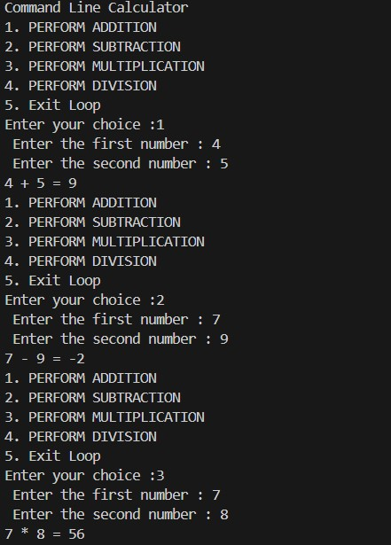
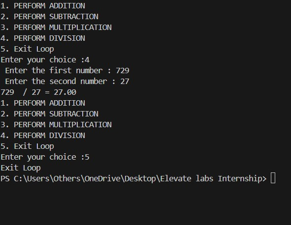

# Command Line Calculator

A simple **Command Line Calculator** built in **Python** that performs basic arithmetic operations — Addition, Subtraction, Multiplication, and Division — using user input directly through the terminal.

---

## Features

* **Addition** of two numbers
* **Subtraction** of two numbers
* **Multiplication** of two numbers
* **Division** of two numbers (with decimal precision)
* **Interactive Menu Loop** — perform multiple operations without restarting the program
* **Exit Option** to end the program 

---

## Requirements

* Python 3.12.7
* VS Code or any code editor
* Access to an integrated or system terminal

---

## How to Run

1. Save the program as **`Task 1.py`**
2. Open the **terminal** in VS Code 
3. Run the file in VS Code terminal.
4. Instructions:

   ```
   Command Line Calculator
   1. PERFORM ADDITION
   2. PERFORM SUBTRACTION
   3. PERFORM MULTIPLICATION
   4. PERFORM DIVISION
   5. Exit Loop
   Enter your choice :
   ```

---

## Example Output

```
Command Line Calculator
1. PERFORM ADDITION
2. PERFORM SUBTRACTION
3. PERFORM MULTIPLICATION
4. PERFORM DIVISION
5. Exit Loop
Enter your choice : 1
Enter the first number : 15
Enter the second number : 5
15 + 5 = 20
```
# Output




<p float="left">
  
  
</p>

---


